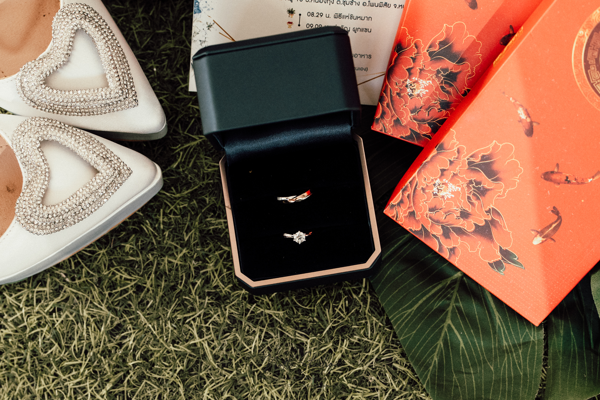
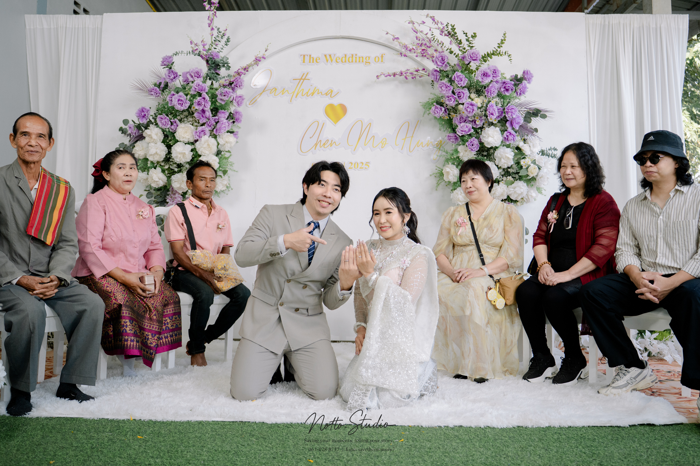

<!DOCTYPE html>
<html lang="th">
<head>
  <meta charset="utf-8" />
  <meta name="viewport" content="width=device-width, initial-scale=1" />
  <title>บริการถ่ายภาพงานพิธี - Save The Memory</title>
  <meta name="description" content="บริการถ่ายภาพงานพิธีแบบมืออาชีพ เก็บทุกโมเมนต์สำคัญให้สวยงามและครบถ้วนที่สุด">

  <!-- Google Font -->
  <link href="https://fonts.googleapis.com/css2?family=Prompt:wght@300;400;500;600;700&display=swap" rel="stylesheet">

  <!-- Tailwind CDN -->
  

  <!-- FontAwesome -->
  <link rel="stylesheet" href="https://cdnjs.cloudflare.com/ajax/libs/font-awesome/6.4.0/css/all.min.css" />

  

  
</head>
<body class="font-sans text-gray-800 antialiased bg-stone-50">

  <!-- NAV -->
  <nav class="fixed top-0 w-full z-50 bg-white/90 backdrop-blur-md shadow-sm py-4 px-6">
    

      <a href="#home" class="text-xl font-bold text-gray-900 tracking-tighter">SAVE THE MEMORY.</a>
      

        <a href="#home" class="hover:text-brand-gold">หน้าแรก</a>
        <a href="#team" class="hover:text-brand-gold">ทีมงาน</a>
        <a href="#portfolio" class="hover:text-brand-gold">ผลงาน</a>
        <a href="#service" class="hover:text-brand-gold">บริการ</a>
        <a href="#pricing" class="hover:text-brand-gold">ราคา</a>
        <a href="#contact" class="px-4 py-2 bg-brand-gold text-white rounded-full hover:bg-yellow-600">จองคิว</a>
      

      <button class="md:hidden text-2xl" onclick="document.getElementById('mobile-menu').classList.toggle('hidden')">
        <i class="fa-solid fa-bars"></i>
      </button>
    

    

      <a href="#home" class="text-gray-700">หน้าแรก</a>
      <a href="#team" class="text-gray-700">ทีมงาน</a>
      <a href="#portfolio" class="text-gray-700">ผลงาน</a>
      <a href="#service" class="text-gray-700">บริการ</a>
      <a href="#pricing" class="text-gray-700">ราคา</a>
      <a href="#contact" class="text-brand-gold font-bold">ติดต่อเรา</a>
    

  </nav>

  <!-- HERO -->
  <section id="home" class="page-section relative text-white pt-24">
    

      
      

    

    

      
Brochure

      <h1 class="text-4xl md:text-6xl font-bold mb-6">บริการถ่ายภาพ งานพิธีแบบมืออาชีพ</h1>
      
เก็บทุกโมเมนต์สำคัญให้สวยงามและครบถ้วนที่สุด ❤️

      

        <a href="#portfolio" class="px-6 py-3 bg-white text-gray-900 rounded-full">ดูผลงาน</a>
        <a href="#contact" class="px-6 py-3 bg-brand-gold text-white rounded-full">จองคิว</a>
      

    

  </section>

  <!-- TEAM -->
  <section id="team" class="py-20 bg-white">
    

      

        <h2 class="text-3xl font-bold text-gray-900 mb-3">ยินดีให้บริการในวันสำคัญของคุณ</h2>
        
ทีมงานมืออาชีพ พร้อมดูแลตั้งแต่ต้นจนจบพิธี

      

      

        

          <i class="fa-solid fa-user-group text-brand-gold text-3xl mb-3"></i>
          <h3 class="font-bold">ช่างภาพ 2 คน</h3>
          
เก็บภาพครอบคลุมทุกมุม

        

        

          <i class="fa-solid fa-camera text-brand-gold text-3xl mb-3"></i>
          <h3 class="font-bold">กล้อง 3 ตัว</h3>
          
เลนส์ครบทุกระยะ

        

        

          <i class="fa-solid fa-lightbulb text-brand-gold text-3xl mb-3"></i>
          <h3 class="font-bold">ไฟ 6 ดวง</h3>
          
แสงสวยทุกรายละเอียด

        

        

          <i class="fa-solid fa-wand-magic-sparkles text-brand-gold text-3xl mb-3"></i>
          <h3 class="font-bold">รีทัชมาตรฐานโปร</h3>
          
Mood & Tone เป็นเอกลักษณ์

        

      

    

  </section>

  <!-- PORTFOLIO -->
  <section id="portfolio" class="py-20 bg-stone-50">
    

      

        <h2 class="text-3xl font-bold text-gray-900 mb-3">ผลงานที่ผ่านมา</h2>
        
ตัวอย่างภาพจากงานพิธีต่าง ๆ — หากไฟล์รูปอยู่ในโฟลเดอร์เดียวกับไฟล์นี้ รูปจะแสดงขึ้น

      

      <!-- Gallery grid: ถ้าภาพอยู่ในโฟลเดอร์เดียวกัน ให้ใช้ชื่อไฟล์ตรง ๆ -->
      

        

          
        

        

          
        

        

          
        

        

          
        

        

          
        

        

          
        

        

          
        

        

          
        

        

          
        

      

      

        <a href="#contact" class="inline-block px-6 py-3 bg-brand-gold text-white rounded-full">ต้องการดูเพิ่มเติม / จองคิว</a>
      

    

  </section>

  <!-- SERVICE -->
  <section id="service" class="py-20 bg-brand-cream/30">
    

      

        

          
        

        

          <h3 class="text-3xl font-bold mb-4">มากกว่าแค่ถ่ายภาพ คือการ ดูแลใส่ใจ</h3>
          
ทีมงานพร้อมช่วยจัดลำดับพิธี ดูแลจังหวะสำคัญ และเก็บรายละเอียดทุกช็อต

        

      

    

  </section>

  <!-- PRICING -->
  <section id="pricing" class="py-20 bg-white">
    

      

        

          <h4 class="font-bold text-xl mb-3">กำหนดการส่งงาน</h4>
          <ul class="text-gray-600 list-disc list-inside">
            <li>ส่งงานไฟล์ภาพคมชัดสูง (High Resolution)</li>
            <li>อัปโหลดผ่าน Cloud Drive ภายใน 2 วัน (มาตรฐาน)</li>
          </ul>
        

        

          
โปรโมชั่น

          <h4 class="font-bold text-xl mb-3">ราคาแพ็กเกจ</h4>
          
4,000 บาท (ปกติ 5,500)

          
มัดจำจองคิว: 500 บาท

        

      

    

  </section>

  <!-- CONTACT -->
  <section id="contact" class="page-section bg-gray-50 py-20">
    

      

        <h2 class="text-3xl font-bold mb-4">สนใจจองคิว / สอบถาม</h2>
        
อย่าปล่อยให้วันสำคัญผ่านไปโดยไม่มีภาพสวยๆ นะครับ

        

          <a href="https://line.me/ti/p/~savethememory7" target="_blank" class="px-6 py-3 bg-[#06C755] text-white rounded-xl flex items-center gap-3">
            <i class="fa-brands fa-line text-2xl"></i> savethememory7
          </a>
          <a href="tel:0630288737" class="px-6 py-3 bg-gray-800 text-white rounded-xl flex items-center gap-3">
            <i class="fa-solid fa-phone-volume"></i> 063-028-8737
          </a>
        

        
&copy; Save The Memory Photography

      

    

  </section>

  <!-- Floating action for mobile -->
  

    <a href="https://line.me/ti/p/~savethememory7" class="w-14 h-14 bg-[#06C755] rounded-full text-white flex items-center justify-center">
      <i class="fa-brands fa-line"></i>
    </a>
    <a href="tel:0630288737" class="w-14 h-14 bg-brand-gold rounded-full text-white flex items-center justify-center">
      <i class="fa-solid fa-phone"></i>
    </a>
  

  
</body>
</html>
